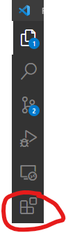
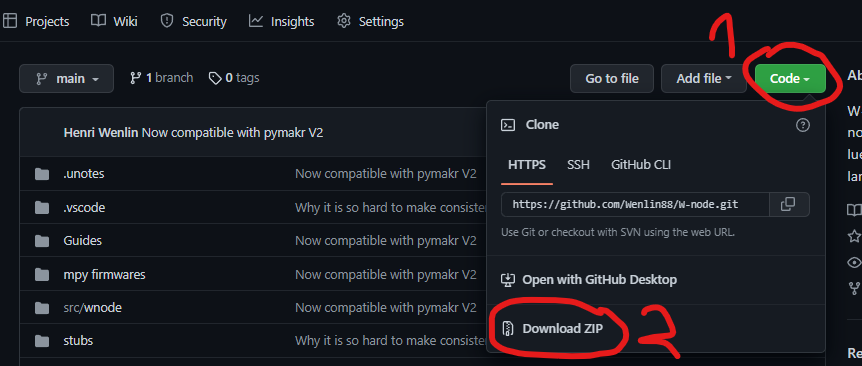
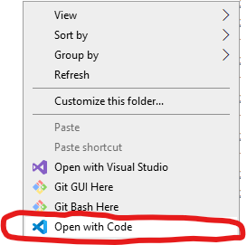
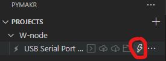
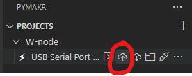
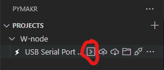

This example is build for M5stack ATOM

1. Install Python environment to your programing computer.

   1. Remember to add python to your path
   2. More information from example [How to install Python in Windows? (tutorialspoint.com)](https://www.tutorialspoint.com/how-to-install-python-in-windows)
2. Then install esptools to your programing computer

   1. This can be done for example by pressing win and typing cmd to windows search bar
   2. Go on top of Command Promt and click with right mouse button
   3. Press Run as administrator
   4. Then write to cmd`pip install esptool`
3. Then connect your M5stack atom to computer
4. Check from device manager allocated com port for your Atom
5. [MicroPython - Python for microcontrollers - M5stack](https://micropython.org/download/M5STACK_ATOM/)
6. Download micropython firmware for ATOM. In this example **[v1.19.1 (2022-06-18) .bin](https://micropython.org/resources/firmware/M5STACK_ATOM-20220618-v1.19.1.bin)**
7. Go to folder where you have your bin file
8. Press shift and right click with your mouse in that folder
9. Select open powershell here
10. Run command (With your ATOM com port)

    1. ```
       esptool --chip esp32 --port COM3 erase_flash

       ```
    2. Then run

       ```
       esptool --chip esp32 --port COM3 --baud 460800 write_flash -z 0x1000 M5STACK_ATOM-20220618-v1.19.1.bin
       ```
11. Install Visual Studio Code and run it

    1. [Visual Studio Code - Code Editing. Redefined](https://code.visualstudio.com/)
12. Install PyMakr to visual studio code

    1. 
    2. 
13. Download W-node project from [Wenlin88/W-node (github.com)](https://github.com/Wenlin88/W-node)

    * 
    * Unzip project
14. Open W-node project with VS code

    1. Go to the W-node project folder and press left mouse button. Select **Open with Code**
    2. 
15. Select PyMakr from side panel

    * 
16. Add your device to project
17. Connect to your board

    
18. Download W-node project to your ATOM. This can take while for the first time

    
19. Connect to serial terminal

    
