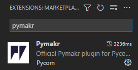
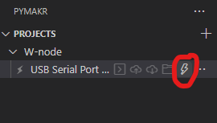

This example is build for M5stack ATOM

1.
2. Install Python environment to your programing computer.

   1. Remember to add python to your path
   2. More information from example [How to install Python in Windows? (tutorialspoint.com)](https://www.tutorialspoint.com/how-to-install-python-in-windows)
3. Then install esptools to your programing computer

   1. This can be done for example by pressing win and typing cmd to windows search bar
   2. Go on top of Command Promt and click with right mouse button
   3. Press Run as administrator
   4. Then write to cmd
      - `pip install esptool`
4. Then connect your M5stack atom to computer
5. Check from device manager allocated com port for your Atom
6. [MicroPython - Python for microcontrollers - M5stack](https://micropython.org/download/M5STACK_ATOM/)
7. Download for example **[v1.19.1 (2022-06-18) .bin](https://micropython.org/resources/firmware/M5STACK_ATOM-20220618-v1.19.1.bin)**
8. Go to folder where you have donwloaded your bin file
9. Press shift and right click with your mouse
10. Select open powershell here
11. Run command (With your ATOM com port)

    1. ```
       esptool --chip esp32 --port COM3 erase_flash

       ```
    2. Then run

       ```
       esptool --chip esp32 --port COM3 --baud 460800 write_flash -z 0x1000 M5STACK_ATOM-20220618-v1.19.1.bin
       ```
12. Install Visual Studio Code

    1. [Visual Studio Code - Code Editing. Redefined](https://code.visualstudio.com/)
13. Install PyMakr to visual studio code

    1. 
14. Restart Visual Studio Code (VS code) and go to PyMakr

    1. 
15. Press add device and select com port where your ATOM is located
16. Connect to your ATOM

    
17.
